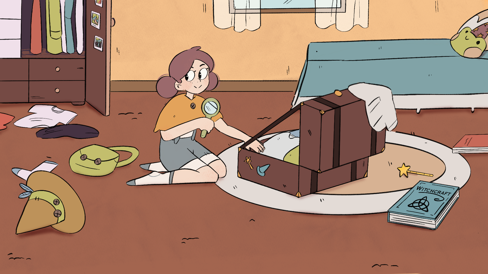

# Spirit 🧙‍♀️✨

**Spirit** es un RPG desarrollado como proyecto universitario por un equipo de cuatro compañeras apasionadas por los videojuegos y la narrativa interactiva. En este juego, tomas el papel de una **aprendiz de bruja** que debe superar misiones, resolver minijuegos y descubrir los secretos de un mundo mágico lleno de desafíos y sorpresas.

Esta es una **demo** que muestra las mecánicas básicas, la estética y la narrativa del juego. Aunque es una versión preliminar, ¡estamos muy orgullosas del trabajo realizado y queremos compartirlo con vosotros!

---

## Captura de Pantalla 🖼️
  
*Cutscene Spirit.*  

---

## Características Principales 🎮

- **Historia envolvente**: Sumérgete en el papel de una joven bruja que debe aprender a dominar sus poderes mientras enfrenta desafíos únicos.
- **Misiones emocionantes**: Completa tareas que te llevarán a explorar un mundo lleno de magia y misterio.
- **Minijuegos variados**: Pon a prueba tus habilidades con diferentes desafíos que te ayudarán a progresar en la historia.
- **Estética única**: Un estilo visual encantador que con elementos de fantasía.

---

## Video de Presentación 

¡Mira nuestro video de presentación para ver el juego en acción!  
https://youtu.be/1Hhst-h1eq4

---

## Equipo de Desarrollo 👩‍💻

Este proyecto fue creado con mucho esfuerzo y dedicación por:

- **Lucía Roldán**  
- **Ekaterina Matveeva** 
- **Lucía Espín** 
- **Sofía García** [instagram](https://www.instagram.com/sofialian_/)

---

## Tecnologías Utilizadas 🛠️

- **Motor de juego**: [Unity]  
- **Lenguajes de programación**: [C#]  
- **Herramientas de diseño**: [Photoshop]  
- **Gestión de proyecto**: [Trello]  

---

¡Gracias por visitar nuestro proyecto! Esperamos que disfrutes de **Spirit** tanto como nosotras disfrutamos creándolo. 🌟  

